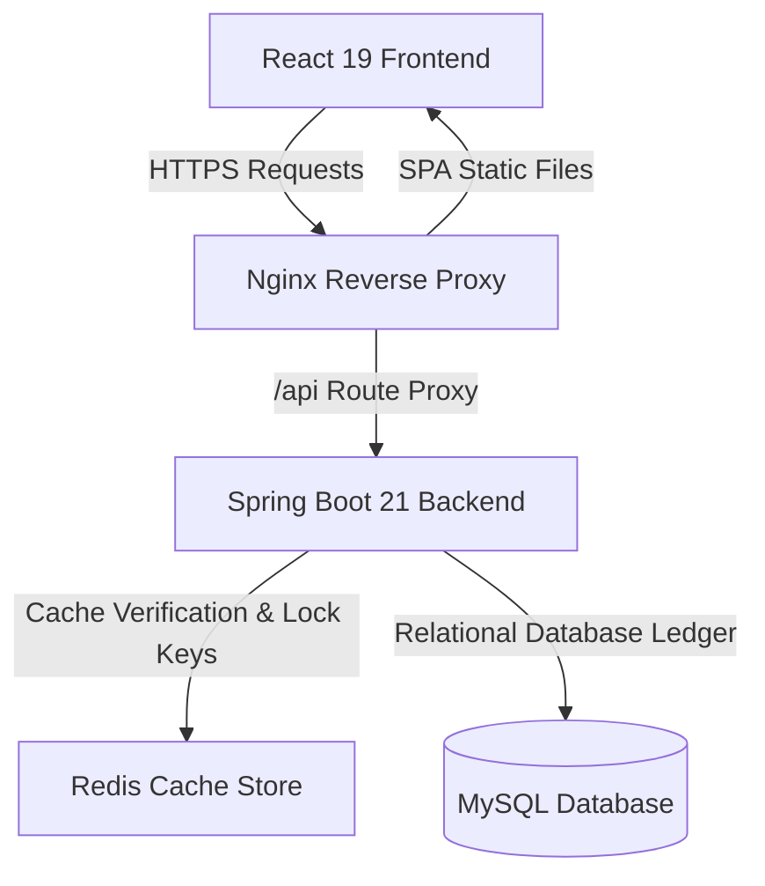
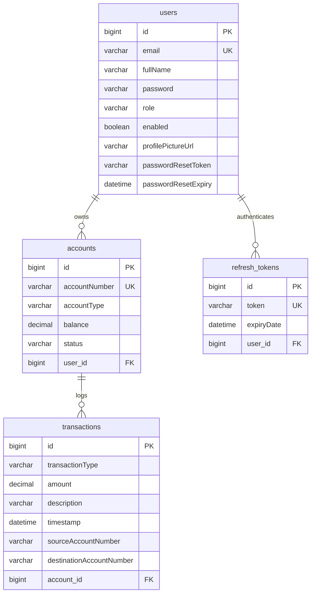

# BankEase - Modern Enterprise Full Stack Banking Core Portal

BankEase is a modern, high-performance, containerized Full Stack Banking Application. Upgraded from an older stack, it now features a **Java 21 + Spring Boot 3.4** core backend and a **React 19 + TypeScript + Vite** frontend, integrated with MySQL and Redis. 

The portal showcases enterprise-inspired design patterns: double-layer Redis caching, transaction idempotency keys, token-bucket API rate limiting, financial-grade `BigDecimal` math, custom JWT refresh token rotation, and administrative security block overrides.

---

## 🏗️ Architecture & Stack



### Technology Stack
*   **Frontend**: React 19, TypeScript, Vite, React Router v7, Tailwind CSS v4, Zustand (State Store), TanStack Query v5 (Data Caching), React Hook Form, Zod, Recharts (Data Visuals), and Framer Motion (Micro-animations).
*   **Backend**: Java 21, Spring Boot 3.4, Spring Security (JWT), Spring Data JPA, Lombok (Boilerplate Removal), MapStruct (Entity DTO Mapping), and SpringDoc OpenAPI (Swagger Docs).
*   **Caching & DB**: MySQL 8.0 (Data Store), Redis 7.0 (Caching, Idempotency Locks, Rate Limits).
*   **Orchestration**: Docker, Docker Compose.

---

## 🗄️ Database Schema & Entities

The relational database enforces financial consistency. The database schema is mapped as follows:



### Schema Constraints
1.  **Precision Math**: All balances and transaction values are stored as `DECIMAL(15, 2)` (parsed as Java `BigDecimal`), avoiding floating-point precision roundings.
2.  **Audit Trail Ledger**: Transfer operations write two distinct entries to maintain dual ledger records: a `TRANSFER_OUT` under the source account and a `TRANSFER_IN` under the destination account, logging audit fields for both source and target account numbers.
3.  **Token Rotation**: Sessions are secured using short-lived JWT access tokens (15 mins) and rotatable database-mapped `refresh_tokens` for user session renewals.

---

## 📂 Project Directory Structure

```text
bankingcore/
├── Backend/                   # Spring Boot Java 21 Backend Project
│   ├── src/main/java/com/bankease/
│   │   ├── config/            # Caching & OpenApi setups
│   │   ├── controller/        # Auth, Users, Accounts, Transactions, Admin APIs
│   │   ├── dto/               # Data Transfer Objects (Payload Validators)
│   │   ├── mapper/            # MapStruct Entity-DTO interfaces
│   │   ├── model/             # JPA Entities (User, Account, Transaction, RefreshToken)
│   │   ├── repository/        # Query repositories
│   │   ├── security/          # Spring Security Filter Chains & JWT Filters
│   │   └── service/           # core Business Logic (Transfer locks, resets, blocks)
│   ├── Dockerfile             # Java 21 Multi-Stage build config
│   └── pom.xml                # Maven Dependencies (Lombok, MapStruct binding)
│
├── frontend/                  # React 19 + TypeScript Frontend Project
│   ├── nginx.conf             # Production Nginx reverse proxy configuration
│   ├── Dockerfile             # Nginx + Node build image compiler
│   ├── src/
│   │   ├── api/               # Axios services with refresh token queues
│   │   ├── components/        # RouteGuard, ToastContainer components
│   │   ├── features/          # Auth, Dashboard, Profile, Transactions, Admin pages
│   │   ├── layouts/           # Sidebar DashboardLayout
│   │   ├── store/             # Zustand stores (Authentication, toast states)
│   │   └── types/             # Common TypeScript interfaces
│   ├── package.json
│   └── vite.config.ts         # Proxy mappings pointing to localhost:8082
│
└── docker-compose.yml         # Global environment orchestration
```

---

## ⚙️ Setup & Deployment

### Option A: Running with Docker Compose (Recommended)
This runs the entire banking portal in a containerized environment (MySQL, Redis, Backend, and Nginx serving React):

1.  Make sure Docker and Docker Compose are installed.
2.  Clone the repository and run:
    ```bash
    docker compose up --build -d
    ```
3.  Once the build completes, access the portal services:
    *   **React Portal (Nginx)**: `http://localhost` (Port 80)
    *   **REST API Swagger Documentation**: `http://localhost:8082/swagger-ui/index.html`
    *   **MySQL Database**: Exposed on host port `3308`
    *   **Redis Database**: Exposed on host port `6379`

To stop and remove containers:
```bash
docker compose down
```

---

### Option B: Running Locally for Development

#### 1. Setup MySQL & Redis
You can run MySQL and Redis easily in Docker:
```bash
docker run --name bankease-mysql -e MYSQL_ROOT_PASSWORD=pandi -e MYSQL_DATABASE=bankease_db -p 3308:3306 -d mysql:8.0
docker run --name bankease-redis -p 6379:6379 -d redis:7.0-alpine
```

#### 2. Start the Backend Core
1. Open the `/Backend` directory.
2. Build the project and run the Spring Boot app:
   ```bash
   ./mvnw spring-boot:run
   ```
   The backend server will run on `http://localhost:8082`.

#### 3. Start the Frontend Dev Server
1. Open the `/frontend` directory.
2. Install packages and launch Vite:
   ```bash
   npm install
   npm run dev
   ```
   Access the React application at the local host url printed in the terminal (usually `http://localhost:5173`). Vite configures proxy endpoints to forward `/api` requests to `http://localhost:8082`.

---

## 🔌 API Endpoints Reference

### Authentication & Users
| Method | Endpoint | Description | Auth Required |
|--------|----------|-------------|---------------|
| `POST` | `/api/auth/register` | Register a new user | No |
| `POST` | `/api/auth/login` | Log in and receive JWT + Refresh Token | No |
| `POST` | `/api/auth/refresh` | Exchange a Refresh Token for a new JWT | No |
| `POST` | `/api/auth/forgot-password` | Request password reset token | No |
| `POST` | `/api/auth/reset-password` | Reset password using generated token | No |
| `GET` | `/api/users/profile` | Retrieve the logged-in user profile | Yes |
| `PUT` | `/api/users/profile` | Update user name details | Yes |
| `POST` | `/api/users/profile/picture` | Upload profile avatar photo | Yes |

### Accounts
| Method | Endpoint | Description | Auth Required |
|--------|----------|-------------|---------------|
| `POST` | `/api/accounts/{userId}?type={type}` | Create a SAVINGS/CURRENT account | Yes |
| `GET` | `/api/accounts/user/{userId}` | Get accounts matching a user | Yes |
| `GET` | `/api/accounts/{accountNumber}/balance` | Fetch current account balance | Yes |

### Transactions Ledger
| Method | Endpoint | Description | Headers / Headers / Notes | Auth Required |
|--------|----------|-------------|---------------------------|---------------|
| `POST` | `/api/transactions/deposit` | Deposit funds | `X-Idempotency-Key` (UUID) | Yes |
| `POST` | `/api/transactions/withdraw` | Withdraw funds | `X-Idempotency-Key` (UUID) | Yes |
| `POST` | `/api/transactions/transfer` | Transfer funds | `X-Idempotency-Key` (UUID) | Yes |
| `GET` | `/api/transactions/account/{accountId}` | Filtered paginated ledger | `type`, `startDate`, `endDate`, `search` | Yes |

### System Administration (Admin Role)
| Method | Endpoint | Description | Auth Required |
|--------|----------|-------------|---------------|
| `GET` | `/api/admin/statistics` | Fetch dashboard portfolio stats | Yes (ADMIN) |
| `GET` | `/api/admin/users` | Fetch paginated users directory | Yes (ADMIN) |
| `GET` | `/api/admin/accounts` | Fetch paginated bank accounts | Yes (ADMIN) |
| `GET` | `/api/admin/transactions` | Fetch paginated system ledger logs | Yes (ADMIN) |
| `PUT` | `/api/admin/users/{id}/status` | Enable/Disable (block) a customer profile | Yes (ADMIN) |
| `PUT` | `/api/admin/accounts/{num}/status` | Suspend/Activate a specific bank account | Yes (ADMIN) |
