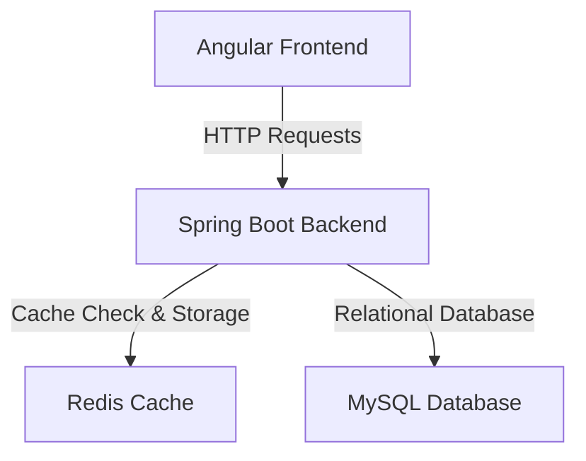

# ThemeForest - Enterprise Banking Core Portal

ThemeForest is a modern, high-performance, fully dockerized Full Stack Banking Application. It features a Spring Boot 3 backend and an Angular frontend, integrated with MySQL and Redis. The system is built with enterprise-grade features including JWT authentication, custom Redis caching, rate limiting, and API idempotency.

---

## 🌟 Key Features

- **Double-Layer Caching (Redis)**: Speeds up account balance and portfolio fetching by caching DB queries. Cleared dynamically upon balance updates or account modifications to prevent stale data.
- **API Rate Limiting**: Built-in protection against brute-force and DDoS attacks using token-bucket rate limiting on critical endpoints.
- **Transaction Idempotency**: Prevents duplicate payments or deposits using unique request tokens (`X-Idempotency-Key` header) validated against Redis.
- **Modern UI Design**: Glassmorphic dashboard built using Angular signals and modern CSS layouts, tailored for a premium user experience.

---

## 🏗️ Architecture & Stack



- **Frontend**: Angular 18+, Standalone Components, Signals, RxJS
- **Backend**: Spring Boot 3.x, Spring Security, JPA/Hibernate, Maven
- **Databases & Cache**: MySQL 8.x, Redis (Alpine)
- **Deployment**: Docker, Docker Compose

---

## 🗄️ Database Schema & Entities

### 1. User (`users`)
Stores registered banking profiles.
- `id` (PK, Auto-Increment)
- `fullName` (VARCHAR, Not Null)
- `email` (VARCHAR, Unique, Not Null)
- `password` (VARCHAR, BCrypt Hashed, Not Null)
- `role` (VARCHAR, Default 'USER')

### 2. Account (`accounts`)
Stores accounts associated with a User.
- `id` (PK, Auto-Increment)
- `accountNumber` (VARCHAR, Unique, Not Null, prefixed with `BA`)
- `accountType` (VARCHAR, e.g., `SAVINGS`, `CHECKING`)
- `balance` (DOUBLE, Default 0.0)
- `user_id` (FK referencing `users`)

### 3. Transaction (`transactions`)
Stores transaction history logs.
- `id` (PK, Auto-Increment)
- `transactionType` (VARCHAR, `DEPOSIT`, `WITHDRAWAL`, `TRANSFER`, `TRANSFER_IN`, `TRANSFER_OUT`)
- `amount` (DOUBLE, Not Null)
- `description` (VARCHAR)
- `timestamp` (TIMESTAMP, Default current time)
- `account_id` (FK referencing `accounts`)

---

## 🔌 API Endpoints Reference

### Authentication
| Method | Endpoint | Description | Auth Required |
|--------|----------|-------------|---------------|
| `POST` | `/api/auth/register` | Register a new user | No |
| `POST` | `/api/auth/login` | Log in and receive JWT | No |

### Accounts
| Method | Endpoint | Description | Auth Required |
|--------|----------|-------------|---------------|
| `POST` | `/api/accounts/{userId}?type={type}` | Create a checking/savings account | Yes |
| `GET` | `/api/accounts/user/{userId}` | Get all accounts for a user | Yes |
| `GET` | `/api/accounts/{accountNumber}/balance` | Fetch the current balance of an account | Yes |

### Transactions
| Method | Endpoint | Description | Auth Required | Headers / Notes |
|--------|----------|-------------|---------------|-----------------|
| `POST` | `/api/transactions/deposit?accountNumber={acc}&amount={val}` | Deposit funds | Yes | Optional `X-Idempotency-Key` |
| `POST` | `/api/transactions/withdraw?accountNumber={acc}&amount={val}` | Withdraw funds | Yes | |
| `POST` | `/api/transactions/transfer` | Transfer funds between accounts | Yes | Payload: `{ fromAccount, toAccount, amount }` |
| `GET` | `/api/transactions/account/{accountId}?page={p}&size={s}` | Get paginated transaction history | Yes | |

---

## ⚙️ Setup & Installation

### Prerequisites
- Docker & Docker Compose installed.
- (Optional for local development) JDK 17+ and Node.js 20+.

### Running with Docker Compose (Recommended)
To launch the entire stack:
```bash
docker compose up --build -d
```
Once started, the services will be available at:
- **Angular Frontend**: `http://localhost` (Port 80)
- **Spring Boot Backend**: `http://localhost:8082`
- **MySQL Database**: Exposed on host port `3308`
- **Redis Cache**: Exposed on host port `6379`

### Stopping the Services
```bash
docker compose down
```

---

## 🧪 Testing

### Running Backend Unit Tests
Ensure the MySQL and Redis Docker containers are running, then execute:
```bash
./mvnw test -DDB_PORT=3308 -DDB_PASSWORD=pandi
```

### Running the API Test Suite Script
A script is provided to test API workflows (registration, login, account creation, idempotency, rate limiting, and caching).
```powershell
powershell -File ./test_api.ps1
```
